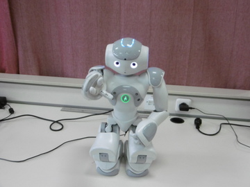

# Interactive co-manipulation agent

A handover algorithm based on the detection of colored objects in the scene
and on deciding about the robot’s ability to execute stable grasping.
Takes into account the relative positioning and orientation of the object inside the field of 
view of the robot's on-board camera.

### Robotic platform

<a href="https://www.ald.softbankrobotics.com/en/robots/nao" target="_blank">NAO</a>
Humanoid robot [NAO](https://www.ald.softbankrobotics.com/en/robots/nao){:target="_blank"}  
* vision: monocular RGB camera
* manipulator: 5-DOF arms, 1-DOF hands

### Detection
The object detection is based on simple color-based segmentation:

* RGB → HSV
* thresholding
* morphological filtering:

* select max-area contour

### Classification
The robot extracts visual geometric features of the object (centroid, width, height, orientation, etc)
and based on training examples of good, average and bad handovers decides if it can grasp it.
The classifier used in a Support Vector Machine with gaussian radial basis kernel.

### Visual servoing and end-effector adaptation
The robot's head follows the object by adjusting its yaw and pitch angles through
a simple proportional control. Given that the training samples were captures in a fixed head orientation
the hand's pose must adapt to compensate the camera frame-hand frame change.

# Dependencies

* numpy
* scikit-learn
* opencv
* naoqi